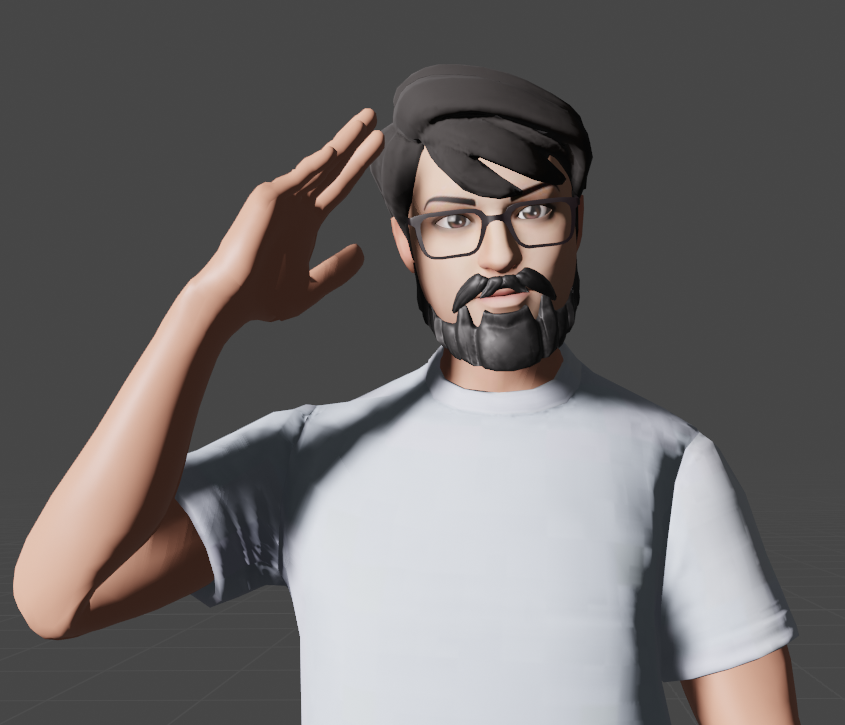

<a name="readme-top"></a>

[![Contributors][contributors-shield]][contributors-url]
[![Forks][forks-shield]][forks-url]
[![Stargazers][stars-shield]][stars-url]
[![Issues][issues-shield]][issues-url]
[![MIT License][license-shield]][license-url]
[![LinkedIn][linkedin-shield]][linkedin-url]

<!-- PROJECT LOGO -->
<br />
<div align="center">
    <a href="https://github.com/suweed/heroewolf">
        
    </a>
    <h3 align="center">Hero Wolf Sellers</h3>
    <p align="center">
        Hero section interactiva con esfera de luz orgánica, cuadrícula 3D y efectos de smoke — construida con React, Vite y Three.js
        <br />
        <a href="https://github.com/suweed/heroewolf"><strong>Explore the docs »</strong></a>
        <br />
        <br />
        <a href="https://github.com/suweed/heroewolf">View Demo</a>
        ·
        <a href="https://github.com/suweed/heroewolf/issues">Report Bug</a>
        ·
        <a href="https://github.com/suweed/heroewolf/issues">Request Feature</a>
    </p>
</div>

<!-- TABLE OF CONTENTS -->
<details>
  <summary>Table of Contents</summary>
  <ol>
    <li>
      <a href="#about-the-project">About The Project</a>
      <ul>
        <li><a href="#built-with">Built With</a></li>
      </ul>
    </li>
    <li>
      <a href="#getting-started">Getting Started</a>
      <ul>
        <li><a href="#prerequisites">Prerequisites</a></li>
        <li><a href="#installation">Installation</a></li>
      </ul>
    </li>
    <li><a href="#contact">Contact</a></li>
  </ol>
</details>

<!-- ABOUT THE PROJECT -->
## About The Project

![Screen Shot][product-screenshot]

Hero section interactiva para Wolf Sellers — agencia Adobe Experience Cloud Partner. Incluye una esfera de luz roja orgánica que sigue el cursor del mouse, una cuadrícula 3D con zona de transparencia animada y un efecto de smoke overlay, todo renderizado en tiempo real con React Three Fiber y Three.js.

<p align="right">(<a href="#readme-top">volver al principio</a>)</p>

### Built With

* [![React][React]][React-url]
* [![Vite][Vite]][Vite-url]
* [![Three.js][Threejs]][Threejs-url]
* [![ReactThreeFiber][R3F]][R3F-url]
* [![Node][Node]][Node-url]
* [![Javascript][Javascript]][Javascript-url]

<p align="right">(<a href="#readme-top">volver al principio</a>)</p>

<!-- GETTING STARTED -->
## Getting Started

Proyecto en React + Vite con Three.js para renderizar una hero section visualmente rica con efectos 3D en tiempo real.

### Prerequisites

* node
  - https://nodejs.org/es
* npm
  - https://www.npmjs.com/

### Installation

1. Clone the repo
   ```sh
   git clone git@github.com:suweed/heroewolf.git
   ```
2. Install NPM packages
   ```sh
   npm install
   ```
3. Start development server
   ```sh
   npm run dev
   ```
4. Build for production
   ```sh
   npm run build
   ```
5. Preview production build
   ```sh
   npm run preview
   ```

<p align="right">(<a href="#readme-top">volver al principio</a>)</p>

<!-- LICENSE -->
## License

Distribuido bajo la licencia MIT. Consulte `LICENSE` para obtener más información.

<p align="right">(<a href="#readme-top">volver al principio</a>)</p>

<!-- CONTACT -->
## Contact

Jesús Cardozo - [@dRsUgAr1221](https://twitter.com/dRsUgAr1221) - gsuskr2o@gmail.com

Project Link: [https://github.com/suweed/heroewolf](https://github.com/suweed/heroewolf)

<p align="right">(<a href="#readme-top">volver al principio</a>)</p>

<!-- MARKDOWN LINKS & IMAGES -->
<!-- https://www.markdownguide.org/basic-syntax/#reference-style-links -->
[contributors-shield]: https://img.shields.io/github/contributors/suweed/heroewolf.svg?style=for-the-badge
[contributors-url]: https://github.com/suweed/heroewolf/graphs/contributors
[forks-shield]: https://img.shields.io/github/forks/suweed/heroewolf.svg?style=for-the-badge
[forks-url]: https://github.com/suweed/heroewolf/network/members
[stars-shield]: https://img.shields.io/github/stars/suweed/heroewolf.svg?style=for-the-badge
[stars-url]: https://github.com/suweed/heroewolf/stargazers
[license-shield]: https://img.shields.io/github/license/suweed/heroewolf.svg?style=for-the-badge
[license-url]: https://github.com/suweed/heroewolf/blob/main/LICENSE
[issues-shield]: https://img.shields.io/github/issues/suweed/heroewolf.svg?style=for-the-badge
[issues-url]: https://github.com/suweed/heroewolf/issues
[linkedin-shield]: https://img.shields.io/badge/-LinkedIn-black.svg?style=for-the-badge&logo=linkedin&colorB=555
[linkedin-url]: https://linkedin.com/in/gsuskr2o
[product-screenshot]: public/images/screen.gif
[Javascript]: https://img.shields.io/badge/javascript-20232A?style=for-the-badge&logo=javascript
[Javascript-url]: https://lenguajejs.com/javascript/
[React]: https://img.shields.io/badge/react-20232A?style=for-the-badge&logo=react&logoColor=61DAFB
[React-url]: https://react.dev/
[Vite]: https://img.shields.io/badge/vite-20232A?style=for-the-badge&logo=vite&logoColor=646CFF
[Vite-url]: https://vite.dev/
[Threejs]: https://img.shields.io/badge/three.js-20232A?style=for-the-badge&logo=threedotjs
[Threejs-url]: https://threejs.org/
[R3F]: https://img.shields.io/badge/%40react--three%2Ffiber-20232A?style=for-the-badge&logo=threedotjs
[R3F-url]: https://r3f.docs.pmnd.rs/
[Node]: https://img.shields.io/badge/node.js-20232A?style=for-the-badge&logo=node.js
[Node-url]: https://nodejs.org/es
